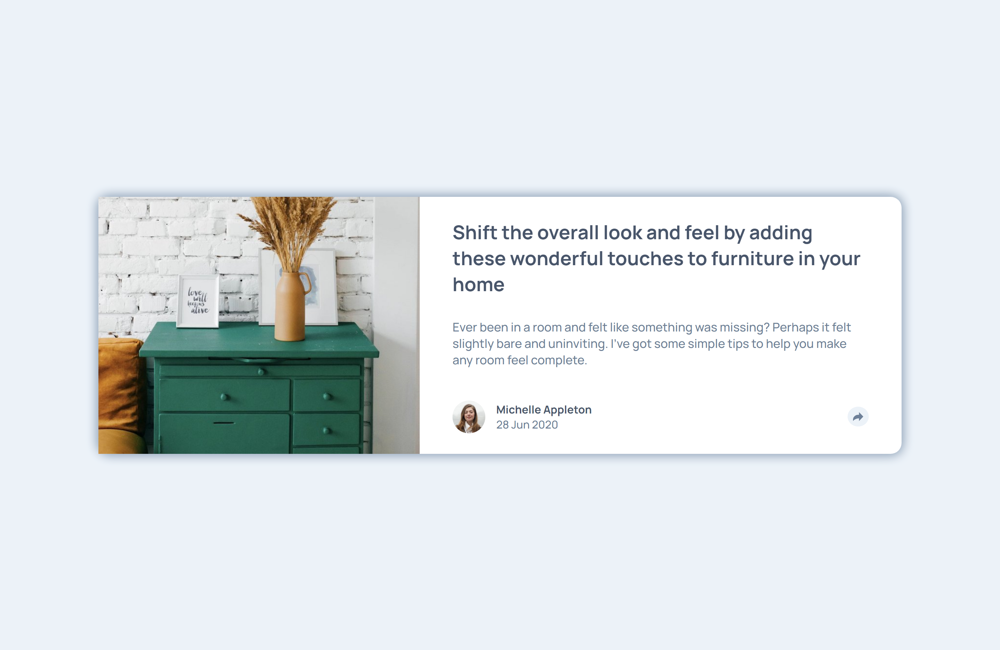
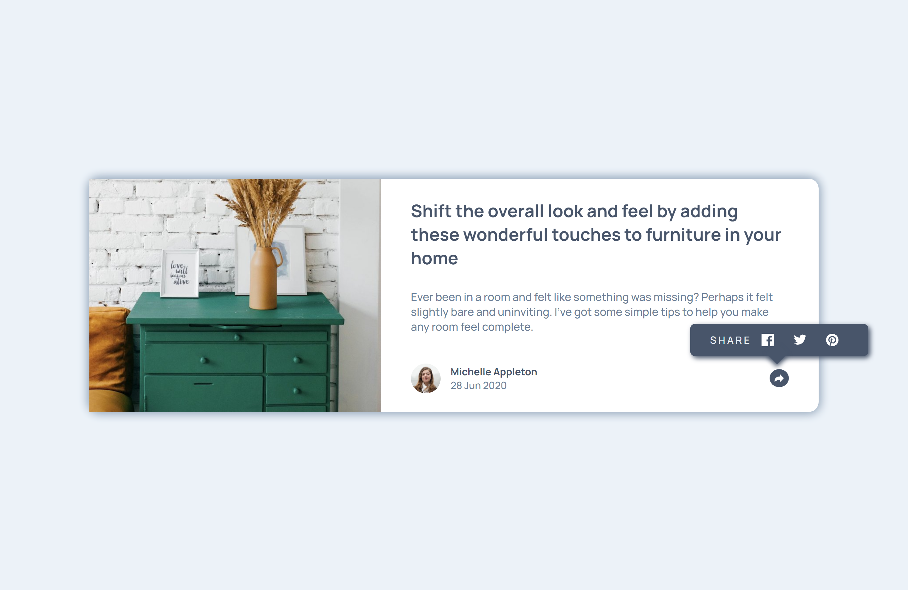
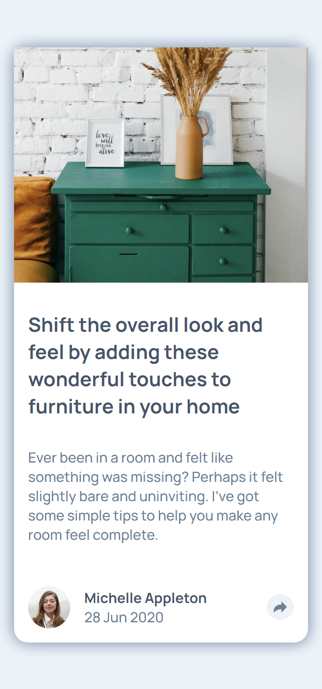
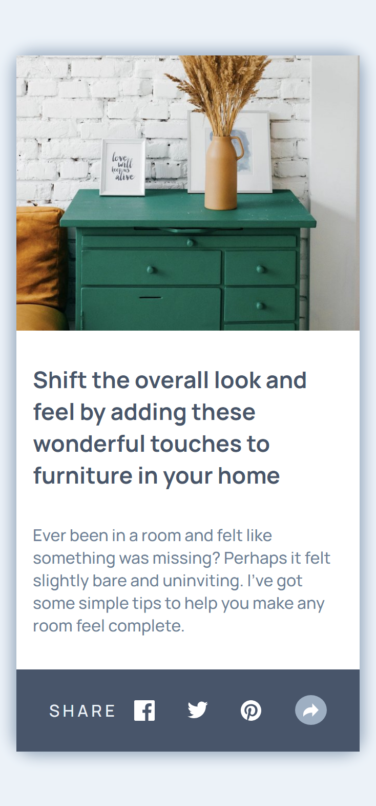

# Frontend Mentor - Article preview component solution

This is a solution to the [Article preview component challenge on Frontend Mentor](https://www.frontendmentor.io/challenges/article-preview-component-dYBN_pYFT).

## Table of contents

- [Overview](#overview)
  - [The challenge](#the-challenge)
  - [Screenshot](#screenshot)
  - [Links](#links)
- [My process](#my-process)
  - [Built with](#built-with)
  - [What I learned](#what-i-learned)
- [Author](#author)

## Overview

### The challenge

Users should be able to:

- View the optimal layout for the component depending on their device's screen size
- See the social media share links when they click the share icon

### Screenshot

;
;
;
;

### Links

- [Github repo](https://github.com/nurmarief/fementor_article-preview-component/)
- [Live site](https://nurmarief.github.io/fementor_article-preview-component/)

## My process

### Built with

- Semantic HTML5 markup
- SASS
- BEM CSS
- CSS grid
- flexbox
- Mobile-first workflow
- Webpack 5
- jquery

### What I learned

In this challenge, I mainly learn about jquery:

1. jquery selector
2. jquery click event
3. jquery DOM manipulation

## Author

- [@nurmarief](https://www.frontendmentor.io/profile/nurmarief)
